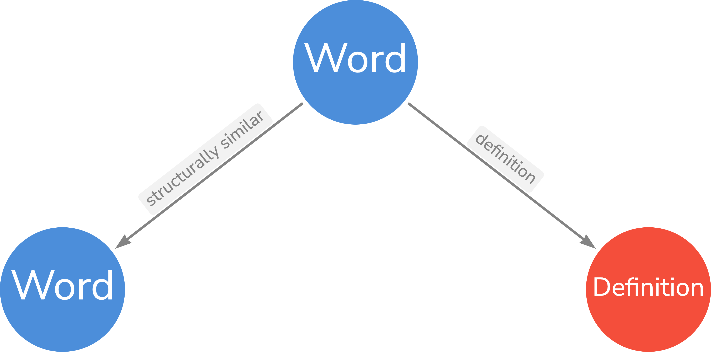

Wiktionary Data on Hugging Face Datasets
========================================

[wiktionary-data]() is a sub-data extraction of the [English Wiktionary](https://en.wiktionary.org), the undoubtedly world's largest freely
available dictionary, and converts it into a machine-readable, structured JSON format what is easy to use for both
linguists and machine learning practitioners. The following languages are currently supported:

> [!TIP]
>
> By "sub-data", it means the project is currently opinionated towards extracting some parts of each Wiktionary entry.
> For example, the definitions are extracted while pronunciation audio is not

- __Deutsch__ - German
- __Latinum__ - Latin
- __Ἑλληνική__ - Ancient Greek
- __한국어__ - Korean
- __𐎠𐎼𐎹__ - [Old Persian](https://en.wikipedia.org/wiki/Old_Persian_cuneiform)
- __𒀝𒅗𒁺𒌑(𒌝)__ - [Akkadian](https://en.wikipedia.org/wiki/Akkadian_language)
- [Elamite](https://en.wikipedia.org/wiki/Elamite_language)
- __संस्कृतम्__ - Sanskrit, or Classical Sanskrit

The datasets are updated daily so that any words added to Wiktionary or improvements made to existing words will soon
appear here. To access the most up-to-date data, load API library first:

```python
from datasets import load_dataset
```

There are __2__ data subsets:

1. __Languages__ subset that contains extraction of a subset of supported languages:

   ```console
   dataset = load_dataset("QubitPi/wiktionary-data", "Wiktionary")
   ```

   The subset contains the splits of the following languages (followed by the invocation of fetching their respective
   splits)

   - __German__: `split = dataset["German"]`
   - __Latin__: `split = dataset["Latin"]`
   - __Ancient Greek__: `split = dataset["AncientGreek"]`
   - __Korean__: `split = dataset["Korean"]`
   - __Old Persian__: `split = dataset["OldPersian"]`
   - __Akkadian__: `split = dataset["Akkadian"]`
   - __Elamite__: `split = dataset["Elamite"]`
   - __Sanskrit__: `split = dataset["Sanskrit"]`

2. __Graph__ subset that is useful for constructing knowledge graphs:

   ```console
   dataset = load_dataset("QubitPi/wiktionary-data", "Knowledge Graph")
   ```

   The subset contains the following splits

   - `AllLanguage`: all the languages listed above in a giant graph

   The _Graph_ data ontology is the following:

   <div align="center">
       
   </div>

> [!TIP]
>
> Two words are structurally similar if and only if the two shares the same
> [stem](https://en.wikipedia.org/wiki/Word_stem)

License
-------

The use and distribution terms for [wiktionary-data]() are covered by the [Apache License, Version 2.0].

[Apache License, Version 2.0]: https://www.apache.org/licenses/LICENSE-2.0
