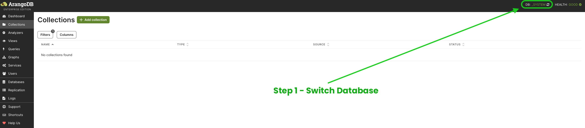
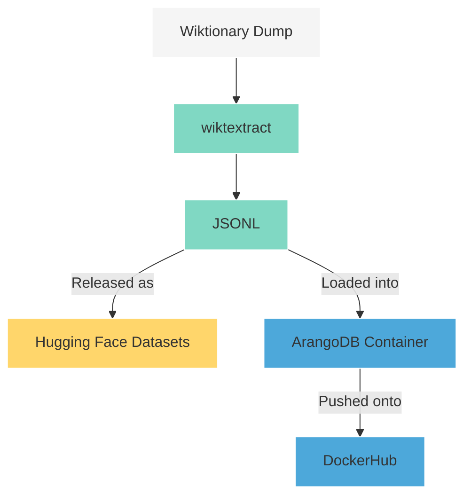

Wiktionary Data
===============

[![Hugging Face dataset badge]][Hugging Face dataset URL]
[![Docker Hub][Docker Pulls Badge]][Docker Hub URL]
[![GitHub workflow status badge][GitHub workflow status badge]][GitHub workflow status URL]
[![Hugging Face sync status badge]][Hugging Face sync status URL]
[![Python Version][Python Version Badge]][Python URL]
[![Apache License Badge]][Apache License, Version 2.0]

[wiktionary-data]() is a _sub-data_ extraction of the [English Wiktionary](https://en.wiktionary.org), the undoubtedly
world's largest freely available dictionary, and converts it into a machine-readable, structured JSON format that is
easy to use for both linguists and artificial intelligence practitioners. The following languages are currently
supported:

> [!TIP]
>
> By "sub-data", it means the project is currently opinionated towards extracting some parts of each Wiktionary entry.
> For example, the definitions are extracted while pronunciation audio is not

- __Deutsch__ - German
- __Latinum__ - Latin
- __Ἑλληνική__ - Ancient Greek
- __한국어__ - Korean
- __𐎠𐎼𐎹__ - [Old Persian](https://en.wikipedia.org/wiki/Old_Persian_cuneiform)
- __𒀝𒅗𒁺𒌑(𒌝)__ - [Akkadian](https://en.wikipedia.org/wiki/Akkadian_language)
- [Elamite](https://en.wikipedia.org/wiki/Elamite_language)
- __संस्कृतम्__ - Sanskrit, or Classical Sanskrit

The Wiktionary language data can be accessed via:

- 🤗 [Hugging Face Datasets][Hugging Face dataset URL], or
- [ArangoDB Docker image][Docker Hub URL]:

  ```console
  docker run -d -p 8529:8529 -e ARANGO_NO_AUTH=1 jack20191124/wiktionary-data
  ```

  ```python
  from arango import ArangoClient

  client = ArangoClient(hosts='http://localhost:8529')
  db = client.db("wiktionary", username='root', password='no-password')
  cursor = db.aql.execute('FOR doc IN German RETURN doc')
  print([document['term'] for document in cursor])
  ```

  The Arango web console is accessible at http://localhost:8529 and should be navigated in the following two steps:

  

  

> [!TIP]
>
> The [conceptual integrity](https://en.wikipedia.org/wiki/The_Mythical_Man-Month#Conceptual_integrity) of designing 2
> major release forms (__HF Datasets__ & __ArangoDB in Docker__) is the following:
>
> - Hugging Face Datasets is architected around __batch processings__. For example, a
>   [filtering operation](https://huggingface.co/docs/datasets/en/process#select-and-filter) against a _single_ German
>   vocabulary on wiktionary-data has been shown to take at _least 10 seconds_ which rendered it obsolete for random
>   operations such as indexing.
> - The ArangoDB container is rolled out exactly for supporting the __efficient search__ against the dataset on the
>   scale of at least _tens of thousands_ indexing in _less than 10 seconds_
>
> Please see [Data Pipeline Overview](#-data-pipeline-overview) and [![DeepWiki badge]][DeepWiki URL] for more details.

🔧 Development
--------------

### 🏗 Environment Setup

Get the source code:

```console
git clone git@github.com:QubitPi/wiktionary-data.git
cd wiktionary-data
```

It is strongly recommended to work in an isolated environment. Install virtualenv and create an isolated Python
environment by

```console
python3 -m pip install --user -U virtualenv
python3 -m virtualenv .venv
```

To activate this environment:

```console
source .venv/bin/activate
```

or, on Windows

```console
./venv\Scripts\activate
```

> [!TIP]
>
> To deactivate this environment, use
>
> ```console
> deactivate
> ```

Lastly, install dependencies via

```console
pip3 install -r requirements.txt
```

### 🔋 Data Source

Although [the original Wiktionary dump](https://dumps.wikimedia.org/) is available, parsing it from scratch involves
rather complicated process. For example,
[acquiring the inflection data of most Indo-European languages on Wiktionary has already triggered some research-level efforts](https://stackoverflow.com/a/62977327).
We would probably do it in the future. At present, however, we would simply take the awesome works by
[__tatuylonen's wiktextract__](https://github.com/tatuylonen/wiktextract) which has already processed it and presented
it in [JSONL format](https://kaikki.org/dictionary/rawdata.html). wiktionary-data sources the data from __raw
Wiktextract data (JSONL, one object per line)__ option there.

### 🚚 Data Pipeline Overview



License
-------

The use and distribution terms for [wiktionary-data]() are covered by the [Apache License, Version 2.0].

[Apache License Badge]: https://img.shields.io/github/license/QubitPi/Antiqua?style=for-the-badge&logo=Apache&logoColor=white&labelColor=FF7777&color=00B8A9
[Apache License, Version 2.0]: https://www.apache.org/licenses/LICENSE-2.0

[DeepWiki badge]: https://img.shields.io/badge/DeepWiki-QubitPi%2Fwiktionary--data-2F2F2F.svg?style=for-the-badge&labelColor=FE6F26&logo=data:image/png;base64,iVBORw0KGgoAAAANSUhEUgAAACwAAAAyCAYAAAAnWDnqAAAAAXNSR0IArs4c6QAAA05JREFUaEPtmUtyEzEQhtWTQyQLHNak2AB7ZnyXZMEjXMGeK/AIi+QuHrMnbChYY7MIh8g01fJoopFb0uhhEqqcbWTp06/uv1saEDv4O3n3dV60RfP947Mm9/SQc0ICFQgzfc4CYZoTPAswgSJCCUJUnAAoRHOAUOcATwbmVLWdGoH//PB8mnKqScAhsD0kYP3j/Yt5LPQe2KvcXmGvRHcDnpxfL2zOYJ1mFwrryWTz0advv1Ut4CJgf5uhDuDj5eUcAUoahrdY/56ebRWeraTjMt/00Sh3UDtjgHtQNHwcRGOC98BJEAEymycmYcWwOprTgcB6VZ5JK5TAJ+fXGLBm3FDAmn6oPPjR4rKCAoJCal2eAiQp2x0vxTPB3ALO2CRkwmDy5WohzBDwSEFKRwPbknEggCPB/imwrycgxX2NzoMCHhPkDwqYMr9tRcP5qNrMZHkVnOjRMWwLCcr8ohBVb1OMjxLwGCvjTikrsBOiA6fNyCrm8V1rP93iVPpwaE+gO0SsWmPiXB+jikdf6SizrT5qKasx5j8ABbHpFTx+vFXp9EnYQmLx02h1QTTrl6eDqxLnGjporxl3NL3agEvXdT0WmEost648sQOYAeJS9Q7bfUVoMGnjo4AZdUMQku50McDcMWcBPvr0SzbTAFDfvJqwLzgxwATnCgnp4wDl6Aa+Ax283gghmj+vj7feE2KBBRMW3FzOpLOADl0Isb5587h/U4gGvkt5v60Z1VLG8BhYjbzRwyQZemwAd6cCR5/XFWLYZRIMpX39AR0tjaGGiGzLVyhse5C9RKC6ai42ppWPKiBagOvaYk8lO7DajerabOZP46Lby5wKjw1HCRx7p9sVMOWGzb/vA1hwiWc6jm3MvQDTogQkiqIhJV0nBQBTU+3okKCFDy9WwferkHjtxib7t3xIUQtHxnIwtx4mpg26/HfwVNVDb4oI9RHmx5WGelRVlrtiw43zboCLaxv46AZeB3IlTkwouebTr1y2NjSpHz68WNFjHvupy3q8TFn3Hos2IAk4Ju5dCo8B3wP7VPr/FGaKiG+T+v+TQqIrOqMTL1VdWV1DdmcbO8KXBz6esmYWYKPwDL5b5FA1a0hwapHiom0r/cKaoqr+27/XcrS5UwSMbQAAAABJRU5ErkJggg==
[DeepWiki URL]: https://deepwiki.com/QubitPi/wiktionary-data
[Docker Pulls Badge]: https://img.shields.io/docker/pulls/jack20191124/wiktionary-data?style=for-the-badge&logo=docker&logoColor=white&labelColor=5BBCFF&color=7EA1FF
[Docker Hub URL]: https://hub.docker.com/r/jack20191124/wiktionary-data

[GitHub workflow status badge]: https://img.shields.io/github/actions/workflow/status/QubitPi/wiktionary-data/ci-cd.yaml?branch=master&style=for-the-badge&logo=github&logoColor=white&label=CI/CD&labelColor=2088FF&color=00BD56
[GitHub workflow status URL]: https://github.com/QubitPi/wiktionary-data/actions/workflows/ci-cd.yaml

[Hugging Face dataset badge]: https://img.shields.io/badge/HF%20Datasets-wiktionary--data-54C392?style=for-the-badge&logo=huggingface&logoColor=white&labelColor=15B392
[Hugging Face dataset URL]: https://huggingface.co/datasets/QubitPi/wiktionary-data

[Hugging Face sync status badge]: https://img.shields.io/github/actions/workflow/status/QubitPi/wiktionary-data/ci-cd.yaml?branch=master&style=for-the-badge&logo=github&logoColor=white&label=HF%20Sync%20Up&labelColor=2088FF&color=00BD56
[Hugging Face sync status URL]: https://github.com/QubitPi/wiktionary-data/actions/workflows/ci-cd.yaml

[Python Version Badge]: https://img.shields.io/badge/Python-3.10-957FEF?style=for-the-badge&logo=python&logoColor=white&labelColor=7161ef
[Python URL]: https://python.qubitpi.org/
